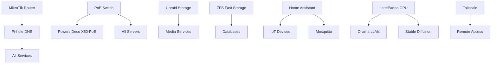

# 🚀 Services Documentation

## 🗺️ Service Network Map

```
                    INTERNET (Dual Fiber + Mobile Backup)
                              │
                    ┌─────────▼─────────┐
                    │  MikroTik Router  │
                    │   172.16.16.1     │
                    └─────────┬─────────┘
                              │
                ┌─────────────┴─────────────┐
                │   SKS3200M PoE+ Switch    │
                └─┬───┬───┬───┬───┬───┬───┬─┘
                  │   │   │   │   │   │   │
    ┌─────────────┘   │   │   │   │   │   └─────────────┐
    │                 │   │   │   │   │                 │
┌───▼──────────────┐ │   │   │   │   │   ┌─────────────▼───┐
│ Pi CasaOS (.15)  │ │   │   │   │   │   │ Deco X50-PoE    │
│ ┌──────────────┐ │ │   │   │   │   │   │ ┌─────────────┐ │
│ │ Pi-hole      │ │ │   │   │   │   │   │ │ IoT VLAN    │ │
│ │ Uptime Kuma  │ │ │   │   │   │   │   │ │ Smart Home  │ │
│ │ NetBox       │ │ │   │   │   │   │   │ └─────────────┘ │
│ │ Sonarr/Radarr│ │ │   │   │   │   │   └─────────────────┘
│ │ qBittorrent  │ │ │   │   │   │   │
│ │ Open WebUI   │ │ │   │   │   │   └───── Cisco Catalyst ─┐
│ └──────────────┘ │ │   │   │   │                          │
└──────────────────┘ │   │   │   │          ┌───────────────▼─┐
                     │   │   │   │          │ Home Assistant  │
┌────────────────────▼┐  │   │   │          │ Raspberry Pi 4  │
│ Unraid N100 (.140)  │  │   │   │          │ ┌─────────────┐ │
│ ┌──────────────────┐│  │   │   │          │ │ Zigbee2MQTT │ │
│ │ 13.7TB Storage   ││  │   │   │          │ │ Node-RED    │ │
│ │ Media Library    ││  │   │   │          │ │ ESPHome     │ │
│ │ Docker Services  ││  │   │   │          │ └─────────────┘ │
│ │ VM Host          ││  │   │   │          └─────────────────┘
│ └──────────────────┘│  │   │   │
└─────────────────────┘  │   │   │          ┌─────────────────┐
                         │   │   │          │ Orange Pi       │
┌────────────────────────▼┐  │   │          │ Cluster (2x)    │
│ CM3588 NAS (.14)        │  │   │          │ ┌─────────────┐ │
│ ┌──────────────────────┐│  │   │          │ │ K3s Worker  │ │
│ │ 7.27TB ZFS RAID-Z2   ││  │   │          │ │ Edge Apps   │ │
│ │ OpenMediaVault       ││  │   │          │ └─────────────┘ │
│ │ Docker Platform      ││  │   │          └─────────────────┘
│ │ 2.5GbE + Jumbo       ││  │   │
│ └──────────────────────┘│  │   └──────────── Deco Mesh APs
└─────────────────────────┘  │                 (M5 x2, P9 x3)
                             │                 ┌─────────────┐
┌────────────────────────────▼┐                │ Guest WiFi  │
│ LattePanda Sigma (.11)      │                │ IoT Network │
│ ┌──────────────────────────┐│                └─────────────┘
│ │ Ollama LLM Server        ││
│ │ 16GB VRAM GPU           ││
│ │ AI/ML Workloads         ││
│ │ Stable Diffusion        ││
│ └──────────────────────────┘│
└─────────────────────────────┘
```

## 📋 Service Distribution by Server

### 🏠 Raspberry Pi CasaOS (172.16.16.15)
**Role**: Main service hub, orchestration, monitoring

#### Core Services
- **CasaOS Dashboard** - Port 80 - Management interface
- **Pi-hole** - Port 80/53 - DNS & ad blocking for entire network
- **Tailscale** - Mesh VPN exit node

#### Monitoring Stack
- **Uptime Kuma** - Port 3001 - Service monitoring
- **Beszel** - Port 8090 - System monitoring
- **Netdata** - Port 19999 - Real-time metrics
- **Glances** - Port 61208 - Resource monitoring
- **MySpeed** - Port 5216 - Internet speed tracking
- **WatchYourLAN** - Network device discovery

#### Media Management
- **Sonarr** - Port 8989 - TV series automation
- **Radarr** - Port 38759 - Movie automation
- **Prowlarr** - Port 9696 - Indexer management
- **Jackett** - Port 9117 - Torrent indexing
- **qBittorrent** - Port 8181 - Download client
- **Autobrr** - Port 7474 - Release automation
- **FlareSolverr** - Port 8191 - Captcha solver

#### Productivity & AI
- **Trilium** - Port 8089 - Note-taking
- **Wallabag** - Port 25661 - Read-it-later
- **Open WebUI** - Port 8081 - AI chat interface
- **Anse** - Port 8014 - AI assistant

#### Infrastructure
- **NetBox** - Port 8000 - Network documentation
- **Syslog-ng** - Port 6514 - Log aggregation
- **OpenSpeedTest** - Port 3004 - Speed testing

### 🗄️ Firebat AM02 N100 - Unraid (172.16.16.140)
**Role**: Cold storage, media library, Docker host

#### Storage Services
- **Unraid Web UI** - Port 80 - Array management
- **SMB/CIFS Shares** - Port 445 - File sharing
- **NFS Shares** - Port 2049 - Linux file sharing

#### Docker Services (Potential/Planned)
- **Plex/Jellyfin** - Media streaming
- **Nextcloud** - Personal cloud
- **PhotoPrism** - Photo management
- **Duplicati** - Backup solution

#### Virtual Machines
- **Windows VM** - Testing environment
- **Linux VMs** - Development servers

### ⚡ CM3588 NAS - OpenMediaVault (172.16.16.14)
**Role**: Fast storage, database hosting, high-performance services

#### Storage Services
- **OpenMediaVault** - Port 80 - NAS management
- **SMB Shares** - Port 445 - 2.5GbE file sharing
- **NFS** - Port 2049 - High-speed NFS
- **iSCSI Target** - Block storage for VMs

#### Performance-Critical Services
- **Database Servers** - MySQL/PostgreSQL
- **Redis Cache** - In-memory database
- **MinIO** - S3-compatible object storage
- **GitLab** - Code repository (planned)

### 🧠 LattePanda Sigma (172.16.16.11)
**Role**: AI compute, LLM hosting, GPU workloads

#### AI Services
- **Ollama** - Port 11434 - LLM API server
  - Llama 3.1 70B
  - CodeLlama 34B
  - Mixtral 8x7B
- **Stable Diffusion WebUI** - Image generation
- **ComfyUI** - Advanced AI workflows
- **LocalAI** - OpenAI-compatible API

#### Development Tools
- **Jupyter Lab** - Data science notebooks
- **VS Code Server** - Remote development
- **CUDA Toolkit** - GPU computing

### 🏠 Raspberry Pi 4 - Home Assistant (IP TBD)
**Role**: Home automation hub

#### Automation Services
- **Home Assistant** - Port 8123 - Smart home platform
- **Node-RED** - Port 1880 - Automation flows
- **Mosquitto MQTT** - Port 1883 - Message broker
- **Zigbee2MQTT** - Zigbee bridge
- **ESPHome** - ESP device management
- **InfluxDB** - Time-series database
- **Grafana** - Port 3000 - Dashboards

### 🌐 Network Services

#### MikroTik Router (172.16.16.1)
- **WebFig** - Port 80 - Web interface
- **WinBox** - Port 8291 - Management
- **API** - Port 8728 - Automation
- **DHCP Server** - IP assignment
- **DNS Cache** - Local DNS
- **Firewall** - Security rules
- **VPN Server** - L2TP/IPSec

#### TP-Link Deco Mesh System
- **Deco App Control** - Cloud managed
- **Guest Network** - Isolated access
- **IoT VLAN** - Device isolation
- **Parental Controls** - Content filtering
- **QoS** - Bandwidth management

## 🔧 Service Categories & Resource Usage

### Always Running (24/7)
| Service | Server | CPU | RAM | Priority |
|---------|--------|-----|-----|----------|
| Pi-hole | Pi CasaOS | Low | 256MB | Critical |
| Tailscale | All servers | Minimal | 50MB | Critical |
| Home Assistant | Pi 4 | Medium | 1GB | High |
| Uptime Kuma | Pi CasaOS | Low | 200MB | High |
| OpenMediaVault | CM3588 | Low | 512MB | High |
| Unraid | N100 | Low | 2GB | Critical |

### On-Demand Services
| Service | Server | Startup Time | Auto-stop |
|---------|--------|--------------|-----------|
| Plex/Jellyfin | Unraid | 30s | After 2h idle |
| Ollama | LattePanda | 45s | After 30min |
| Stable Diffusion | LattePanda | 60s | After 15min |
| Development VMs | Unraid | 2min | Manual |

### Scheduled Services
| Service | Schedule | Purpose |
|---------|----------|---------|
| Backup jobs | 2 AM daily | Data protection |
| Media scans | 3 AM daily | Library updates |
| Speed tests | Every 6h | Connection monitoring |
| Security scans | Weekly | Vulnerability checks |

## 🌍 External Access Matrix

### Public Services (Via Reverse Proxy)
| Service | Domain | Authentication | SSL |
|---------|--------|----------------|-----|
| None currently | - | - | - |

### VPN-Only Services (Tailscale)
| Service | Tailscale URL | Access Level |
|---------|---------------|--------------|
| All services | [hostname].tail[scale] | Full admin |
| Media servers | Direct IP | Media only |
| File shares | SMB/NFS | Authenticated |

### Local-Only Services
| Service | Restriction | Reason |
|---------|-------------|--------|
| CasaOS Dashboard | LAN only | Security |
| Router management | LAN only | Security |
| IPMI/iDRAC | Management VLAN | Security |

## 📈 Network Traffic Patterns

### High Bandwidth Services
1. **Media Streaming** (Plex/Jellyfin) - Up to 100Mbps per 4K stream
2. **File Transfers** (SMB/NFS) - Saturates 2.5GbE on CM3588
3. **Backups** - Scheduled during off-hours
4. **AI Model Loading** - Burst traffic when loading LLMs

### Latency-Sensitive Services
1. **DNS (Pi-hole)** - <1ms response required
2. **Home Automation** - <100ms for IoT commands
3. **Gaming/Streaming** - QoS priority on router

### Cross-VLAN Traffic
- **Main → IoT**: Allowed (HA control)
- **IoT → Main**: Blocked (security)
- **Guest → Any**: Internet only
- **Management → All**: Admin only

## 🔐 Service Security

### Authentication Methods
- **SSO**: Planned with Authentik
- **2FA**: Enabled where supported
- **API Keys**: For automation
- **Certificates**: For service-to-service

### Backup Strategy
| Data Type | Frequency | Destination | Retention |
|-----------|-----------|-------------|-----------|
| Configs | Daily | Unraid + Cloud | 30 days |
| Databases | Daily | ZFS snapshots | 7 days |
| Media | Weekly | Unraid array | Forever |
| Documents | Real-time | Multiple copies | Forever |

## 🚨 Service Dependencies



## 🎯 Performance Optimization

### Network Optimization
- **Jumbo Frames**: Enabled on storage network (MTU 9000)
- **Link Aggregation**: Planned for Unraid
- **QoS Rules**: Media streaming priority
- **VLAN Separation**: Reduced broadcast domains

### Storage Optimization
- **ZFS ARC**: 11GB RAM cache on CM3588
- **SSD Caching**: Planned for Unraid
- **Compression**: ZFS with LZ4
- **Deduplication**: Disabled (RAM intensive)

### Service Optimization
- **Container Limits**: CPU/RAM restrictions
- **Scheduling**: Heavy tasks at night
- **Caching**: Redis for web services
- **CDN**: Considered for external access

---

*Last updated: December 2024*